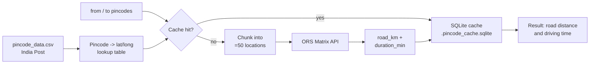

<div align="center">

<br />

# Indian Pincode Distance Calculator

### **The road (transport) distance between any two Indian pincodes — free, fast, and built for bulk.**

<br />

[](https://www.python.org/downloads/)
[](#license)
[](#dataset)
[](https://openrouteservice.org/)
[](#dataset)
[](#bulk-lookups)
[](#requirements)

<br />

**Look up real driving distance and ETA between any two of India's 19,586 pincodes.**
**No paid API. No `pip install`. No surprises.**

<br />

[Get started](#quick-start) ·
[Bulk lookups](#bulk-lookups) ·
[Self-host](#self-hosted-osrm) ·
[FAQ](#faq)

<br /><br />

</div>

---

## Table of Contents

1. [Overview](#overview)
2. [Features](#features)
3. [Demo](#demo)
4. [Quick Start](#quick-start)
5. [Usage](#usage)
6. [Bulk Lookups](#bulk-lookups)
7. [Configuration](#configuration)
8. [Architecture](#architecture)
9. [Backends](#backends)
10. [Self-hosted OSRM](#self-hosted-osrm)
11. [Dataset](#dataset)
12. [Performance](#performance)
13. [FAQ](#faq)
14. [Roadmap](#roadmap)
15. [Contributing](#contributing)
16. [License](#license)

---

## Overview

This project pairs the **official India Post pincode dataset** (19,586 unique pincodes with lat/long) with the **OpenRouteService Matrix API** to give you the **actual road distance** between any two Indian pincodes — not the straight-line "as the crow flies" number.

It's designed for three audiences:

- **Developers** who need a quick CLI to look up a pincode-to-pincode distance.
- **Logistics & e-commerce teams** who need to compute thousands of pincode pairs for shipping zones, ETAs, or route planning.
- **Researchers** who want a clean, free dataset of Indian post offices joined with road-network distances.

### Why this exists

Most online "pincode distance" calculators either:

- Charge per call (Google Maps Distance Matrix), or
- Show only **straight-line** distance (which is wrong for transport planning), or
- Are wrapped in ads and pop-ups.

This repo gives you a **free, scriptable, batch-friendly** alternative — fork it and run it locally.

---

## Features

| Feature | What it gives you |
|---|---|
| **Real road distance** | OpenRouteService Matrix API on the OpenStreetMap road network — not the straight-line guess |
| **19,586 pincodes** | Every Indian pincode with valid coordinates from India Post |
| **Single + batch mode** | One pair from the CLI, or thousands from a CSV |
| **20,000+ lookups/day, free** | Fits comfortably in the ORS free tier thanks to smart chunking |
| **SQLite cache** | Symmetric — A->B and B->A share an entry. Re-runs are instant. |
| **Zero dependencies** | Pure Python standard library. No `pip install`. |
| **Self-hosting option** | Docker Compose for unlimited, offline OSRM (`./setup-osrm.sh` + `docker compose up`) |
| **Configurable backend** | `BACKEND=ors` (default) or `BACKEND=osrm` via env var |
| **Honest output** | Only road (transport) distance + ETA. No misleading aerial numbers. |
| **Open dataset** | `pincode_data.csv` is included in the repo (~22 MB) |

---

## Demo

```
$ python3 pincode_distance.py 560076 560103

Loading pincode_data.csv ...
Loaded 19,561 pincodes with valid coordinates.
Backend: ORS

From: 560076  Mico Layout S.O, BENGALURU URBAN, KARNATAKA
To  : 560103  Bellandur S.O, BENGALURU URBAN, KARNATAKA

Road distance (ORS)  : 13.42 km
Estimated driving time : 32m
```

---

## Quick Start

### Requirements

- Python 3.7 or newer
- An internet connection (or run [self-hosted OSRM](#self-hosted-osrm))
- A free OpenRouteService API key (~2 minutes to set up — see step 2)

That's it. **No `pip install` is needed** — the script uses only the Python standard library.

### Step 1 — Fork and clone

Click the **Fork** button at the top-right of this repo, then:

```bash
git clone https://github.com/<your-username>/Indian-Pincode-Distance.git
cd Indian-Pincode-Distance
```

### Step 2 — Get a free OpenRouteService API key

This is a one-time, ~2-minute process. **No credit card required.**

#### Detailed walkthrough

**1. Open the sign-up page**

Go to https://openrouteservice.org/dev/#/signup

**2. Create an account**

You can sign up in either of two ways:

- **With GitHub** — click *"Sign up with GitHub"* and authorize the app. Fastest option.
- **With email** — fill in your name, email, and a password, then tick the terms checkbox.

**3. Verify your email**

Check your inbox for a confirmation email from `noreply@openrouteservice.org` and click the verification link. (Check spam if you don't see it within a minute.)

**4. Log in to the dashboard**

After verifying, you'll be redirected to the developer dashboard at https://openrouteservice.org/dev/#/home. If not, log in manually with the credentials you just created.

**5. Request a token**

On the left sidebar, click **"Tokens"** (or **"Request a Token"** if it's your first time).

- **Token type:** Select `Standard` (this is the free tier with 2,000 directions/day and 500 matrix/day).
- **Token name:** Anything memorable, e.g. `pincode-distance-cli`.
- Click **"CREATE TOKEN"**.

**6. Copy your API key**

Your new token will appear in the tokens list. Click the **copy icon** next to it. The key looks something like:

```
5b3ce3597851110001cf6248abcdef1234567890abcdef1234567890
```

Treat it like a password — don't commit it to git or share it publicly.

**7. Set it as an environment variable**

| OS | Command |
|---|---|
| macOS / Linux | `export ORS_API_KEY="your-key-here"` |
| Linux (persist) | Add the line above to `~/.bashrc` or `~/.zshrc` |
| Windows PowerShell | `$env:ORS_API_KEY="your-key-here"` |
| Windows CMD | `set ORS_API_KEY=your-key-here` |

To verify it's set:

```bash
echo $ORS_API_KEY        # macOS / Linux
echo $env:ORS_API_KEY    # PowerShell
```

#### Free tier limits

| Endpoint | Daily limit | Per-minute limit | Notes |
|---|---|---|---|
| Directions | 2,000 / day | 40 / min | Single A->B routes |
| **Matrix** *(used by this script)* | **500 / day** | **40 / min** | Up to 50 locations per call |
| Isochrones | 500 / day | 20 / min | Reachability polygons |
| Geocoding | 1,000 / day | 100 / min | Place name -> coordinates |

> **Why this is enough for 20K+ pincode pairs:** each Matrix call carries up to 50 locations, returning a 50x50 = **2,500-pair grid**. The script deduplicates locations within each chunk, so common origins/destinations are reused for free. In practice, 20,000 pincode pairs take only **a few hundred** API calls — well within the 500/day limit.

#### Need more?

If you outgrow the free tier:

- **Upgrade ORS** — paid plans start at a few EUR/month for higher limits.
- **Self-host OSRM** — completely unlimited and offline. See [Self-hosted OSRM](#self-hosted-osrm).

### Step 3 — Run a lookup

```bash
python3 pincode_distance.py 560076 560103
```

Done. You'll see the road distance and driving time printed in your terminal.

---

## Usage

### Single lookup

```bash
python3 pincode_distance.py <from_pincode> <to_pincode>
```

**Examples:**

| Command | Route |
|---|---|
| `python3 pincode_distance.py 110001 400001` | New Delhi -> Mumbai |
| `python3 pincode_distance.py 110001 560001` | New Delhi -> Bangalore |
| `python3 pincode_distance.py 700001 600001` | Kolkata -> Chennai |
| `python3 pincode_distance.py 380001 411001` | Ahmedabad -> Pune |
| `python3 pincode_distance.py 560076 560103` | Mico Layout -> Bellandur (Bengaluru) |

### Batch lookup

Prepare a CSV with two columns named `from` and `to`:

```csv
from,to
110001,400001
110001,560001
700001,600001
560076,560103
```

Then run:

```bash
python3 pincode_distance.py --batch sample_pairs.csv results.csv
```

A working example file is included as [`sample_pairs.csv`](sample_pairs.csv).

---

## Bulk Lookups

The script is built around the assumption that you'll often want to compute **thousands** of pincode pairs at a time — for shipping zones, ETAs, fulfillment planning, etc.

### How it stays in the free tier

| Limit | ORS Free Tier | This script's usage |
|---|---|---|
| Matrix calls / day | 500 | Typically far less, thanks to chunking |
| Locations / call | 50 | Up to 50 (deduplicated) |
| Calls / minute | 40 | Rate-limited to ~37 by default |
| Cost | $0 | **$0** |

### How chunking works

Each ORS Matrix call carries up to 50 unique locations and returns the full N x N distance grid. The script:

1. **Deduplicates** locations within each chunk (so a single warehouse paired with 49 destinations costs 1 API call, not 49).
2. **Caches** every result in `.pincode_cache.sqlite`. The cache is symmetric — `(A, B)` and `(B, A)` share one row.
3. **Rate-limits** itself to stay under 40 calls/minute.

> **Real-world example:** Computing distances from one warehouse to 1,000 customer pincodes uses only ~20 API calls (50 destinations per call), not 1,000.

### Output CSV columns

| Column | Description |
|---|---|
| `from`, `to` | Input pincodes |
| `from_office`, `from_district`, `from_state` | Origin info from the dataset |
| `to_office`, `to_district`, `to_state` | Destination info from the dataset |
| `road_km` | Road (transport) distance from ORS |
| `duration_min` | Estimated driving time in minutes |
| `status` | `ok`, `ok_cached`, `missing_coords`, `no_route`, or `ors_error: ...` |

---

## Configuration

All configuration is via environment variables — no config file needed.

| Variable | Default | Purpose |
|---|---|---|
| `ORS_API_KEY` | *(required)* | Your OpenRouteService API key |
| `BACKEND` | `ors` | Routing backend: `ors` or `osrm` |
| `ORS_DELAY` | `1.6` | Seconds between ORS calls (40 calls/min limit) |
| `CACHE_DB` | `.pincode_cache.sqlite` | Local cache file path |
| `PINCODE_CSV` | `pincode_data.csv` | Path to the dataset |
| `OSRM_BASE` | public demo URL | OSRM endpoint when `BACKEND=osrm` |
| `OSRM_DELAY` | `1.0` | Seconds between OSRM calls in batch mode |

---

## Architecture



The flow:

1. Load `pincode_data.csv` into a dict keyed by pincode.
2. For each pair, check the local SQLite cache first.
3. For cache misses, group pairs into chunks of up to 50 unique locations.
4. POST each chunk to the ORS Matrix endpoint and pull `(distance, duration)` out of the returned matrix.
5. Cache every result so future runs are free.

---

## Backends

| Backend | Setup | Speed | Daily limit | Best for |
|---|---|---|---|---|
| **OpenRouteService** *(default)* | Free API key, ~2 minutes | ~30-40 pairs/sec | 500 matrix calls (~20K+ pairs) | Most users |
| **OSRM public demo** | None | ~1 pair/sec | Soft rate limit | Quick tests, no API key |
| **OSRM self-hosted** | Docker, ~30 min one-time | 100+ pairs/sec | **Unlimited** | 50K+ pairs/day, offline use |

Switching backends is one environment variable:

```bash
# Use OSRM public demo (no API key needed)
export BACKEND=osrm
python3 pincode_distance.py 560076 560103

# Use self-hosted OSRM for unlimited calls
export BACKEND=osrm
export OSRM_BASE=http://localhost:5000/route/v1/driving
export OSRM_DELAY=0
python3 pincode_distance.py --batch sample_pairs.csv results.csv
```

---

## Self-hosted OSRM

For workloads beyond 20K/day — or for **completely offline** use — self-host the OSRM routing engine with the included Docker setup. One-time preprocessing of the India OpenStreetMap extract takes ~30 minutes and ~8-16 GB RAM.

<details>
<summary><b>Click to expand the setup instructions</b></summary>

### Requirements

- Docker
- ~5 GB free disk space
- ~8-16 GB RAM (only during preprocessing; runtime is much less)
- ~30 minutes (depending on CPU and disk speed)

### Setup

```bash
# 1. Download India OSM data + preprocess (one time)
./setup-osrm.sh

# 2. Start your local OSRM server
docker compose up -d

# 3. Point the script at your local server
export BACKEND=osrm
export OSRM_BASE=http://localhost:5000/route/v1/driving
export OSRM_DELAY=0

# 4. Run unlimited lookups
python3 pincode_distance.py 110001 400001
python3 pincode_distance.py --batch sample_pairs.csv results.csv
```

### Performance

20,000 lookups against your local OSRM server take roughly **3-4 minutes**. Each individual call returns in under 10 ms.

### Stopping the server

```bash
docker compose down
```

</details>

---

## Dataset

The file [`pincode_data.csv`](pincode_data.csv) (~22 MB) is included in the repo and sourced from the official **India Post** dataset.

| Statistic | Value |
|---|---|
| Total post offices | **165,627** |
| Unique pincodes | **19,586** |
| States and Union Territories | 37 |
| Rows with valid lat/long | ~93% |
| File size | ~22 MB |

### Schema

| Column | Description |
|---|---|
| `circlename` | Postal circle (e.g., Telangana Circle) |
| `regionname` | Postal region |
| `divisionname` | Postal division |
| `officename` | Name of the post office |
| `pincode` | 6-digit pincode |
| `officetype` | BO / SO / HO |
| `delivery` | Delivery status |
| `district` | District name |
| `statename` | State / UT name |
| `latitude` | Latitude (or `NA`) |
| `longitude` | Longitude (or `NA`) |

> **Note on coordinates:** A pincode often serves multiple post offices. The script uses the **first valid** row per pincode as the representative location. This is usually the head/sub post office, but may not be the exact geographic centroid of the pincode area.

---

## Performance

Rough numbers (will vary by network and target server):

| Mode | Backend | Throughput | 20K pair workload |
|---|---|---|---|
| Cold cache | ORS Matrix | ~30-40 pairs/sec (chunked) | ~10-15 minutes |
| Warm cache | any | ~50,000 pairs/sec | < 1 second |
| Cold cache | OSRM public demo | ~1 pair/sec | several hours |
| Cold cache | OSRM self-hosted | ~100+ pairs/sec | ~3-4 minutes |

The cache is the secret weapon — once a pair is computed, every future run reads it back from SQLite for free.

---

## FAQ

<details>
<summary><b>Why OpenRouteService and not Google Maps?</b></summary>

ORS is free, requires no credit card, and has a generous matrix endpoint that lets you query up to 2,500 pairs per API call. Google Maps Distance Matrix charges per call after a small free trial and requires billing setup.

</details>

<details>
<summary><b>How accurate is the road distance?</b></summary>

ORS uses the same OpenStreetMap road network as most open-source routers. For Indian highways and major urban routes it's typically within a few percent of Google Maps. For very remote rural roads, OSM coverage can be sparser.

</details>

<details>
<summary><b>Why are some pincodes not found?</b></summary>

About 25 unique pincodes in the dataset have no valid coordinates (every row for them is `NA`). Those can't be looked up. The vast majority (19,561 / 19,586) are usable.

</details>

<details>
<summary><b>Multiple post offices share one pincode — which location does it use?</b></summary>

The **first valid row** per pincode in the CSV. This is typically the head post office for that pincode area, but it may not be the geographic centroid.

</details>

<details>
<summary><b>I hit my ORS daily quota — what now?</b></summary>

Either:
- Wait 24 hours for the quota to reset, or
- Switch to self-hosted OSRM: `export BACKEND=osrm` after running `./setup-osrm.sh`.

Cached results are read from SQLite and never re-call any API.

</details>

<details>
<summary><b>Can I run this completely offline?</b></summary>

Yes. Self-host OSRM with `./setup-osrm.sh` and `docker compose up`, then everything runs on `localhost`. No internet required after the initial OSM data download.

</details>

<details>
<summary><b>Is this respectful of the OSRM public demo's terms?</b></summary>

The script rate-limits itself to about 1 request/second when using the OSRM public demo. For heavier use, please switch to ORS or self-host OSRM.

</details>

<details>
<summary><b>Can I use this commercially?</b></summary>

The code is MIT-licensed — yes. The dataset belongs to India Post; check their terms before redistributing the raw CSV. ORS and OSM data are CC-BY-SA / ODbL — attribution is appreciated.

</details>

---

## Roadmap

Ideas that would be nice to have. PRs welcome!

- [ ] Simple Flask / FastAPI web UI with a search box and a map
- [ ] Nearest-pincode search (given a lat/long)
- [ ] Bulk ETA-only mode for delivery planning
- [ ] CSV input that takes city/office names instead of pincodes
- [ ] Pre-built shipping zone calculator
- [ ] Optional `pandas` accelerator for very large batches
- [ ] GitHub Action that publishes a fresh `pincode_data.csv` monthly

---

## Contributing

Contributions are welcome — open an issue first if you're planning a big change.

```bash
# Fork, then:
git checkout -b feat/your-thing
# make changes
python3 pincode_distance.py 560076 560103   # smoke test
git commit -am "feat: your thing"
git push origin feat/your-thing
# open a PR
```

---

## License

[MIT](#license). The dataset belongs to India Post; please check their terms before redistribution. Routing data is provided by [OpenRouteService](https://openrouteservice.org/) and [OpenStreetMap](https://www.openstreetmap.org/) contributors.

---

## Acknowledgments

- [India Post](https://www.indiapost.gov.in/) for the pincode dataset
- [OpenRouteService](https://openrouteservice.org/) for the free routing API
- [Project OSRM](https://project-osrm.org/) for the open-source routing engine
- [OpenStreetMap](https://www.openstreetmap.org/) contributors for the road network data
- [Geofabrik](https://download.geofabrik.de/) for the India OSM extracts

---

<div align="center">

<br />

**If this project helped you, please give it a star — it really does motivate further work.**

<br />

Made with Python and OpenRouteService.

[Back to top](#indian-pincode-distance-calculator)

<br />

</div>
